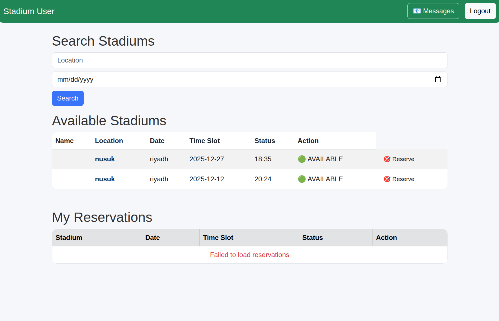
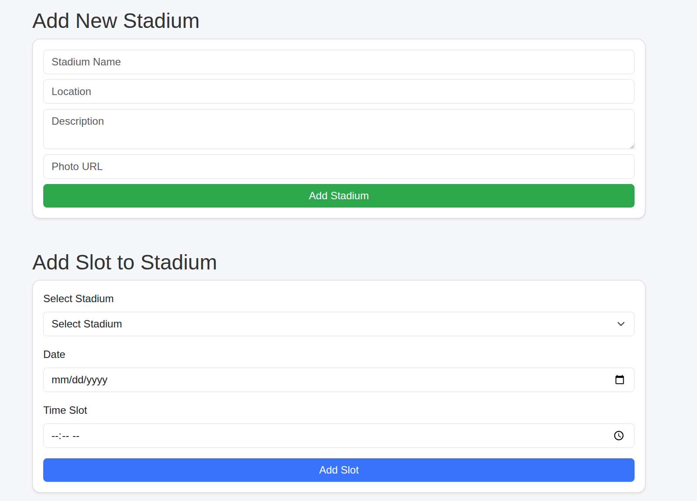
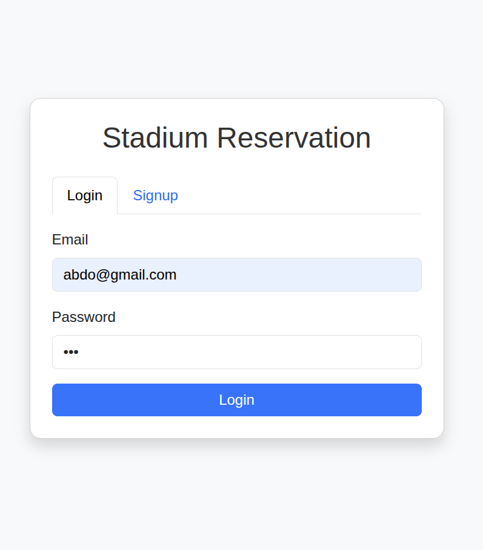
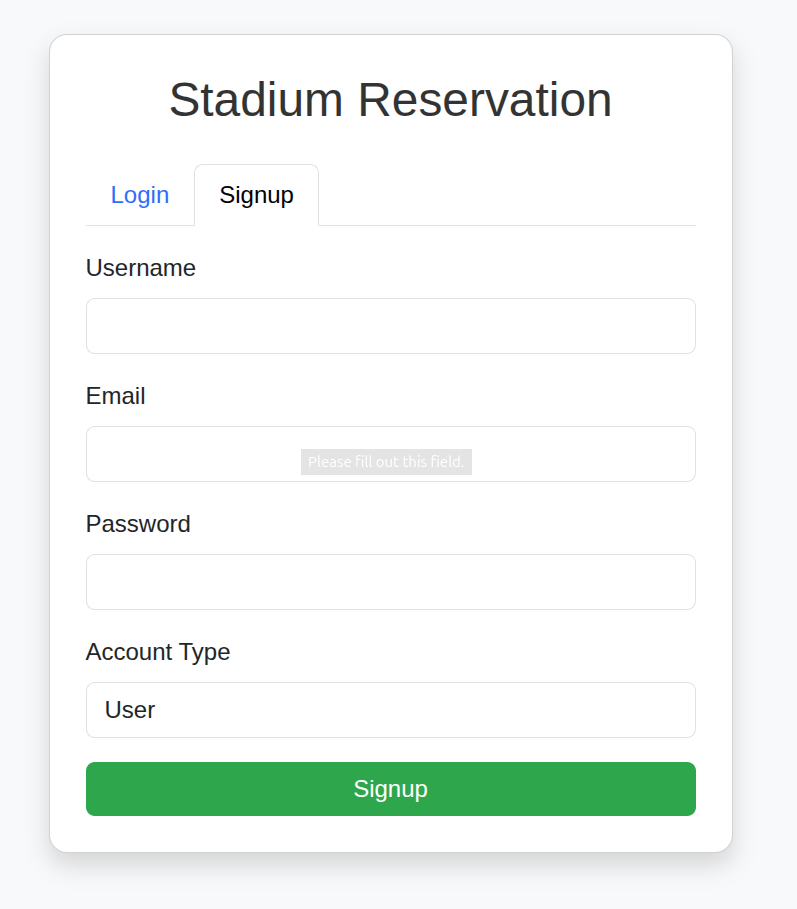
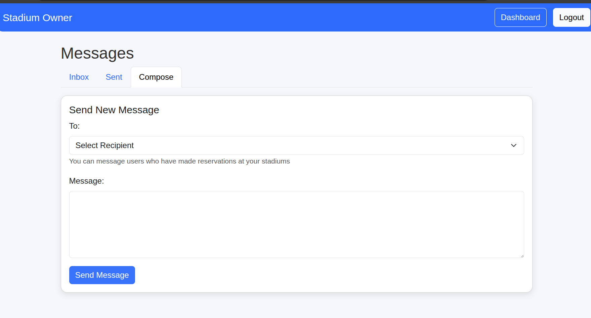

🏟️ Stadium Reservation System

A web-based platform that enables stadium owners and users to manage field reservations efficiently. The system provides real-time slot booking, reservation management, messaging, and analytics.
## 📸 Interface Screenshots

### User Interface
| Home Page | Stadium Reservation |
| :---: | :---: |
|  |  |

### Authentication
| Login | Sign Up |
| :---: | :---: |
|  |  |

### Owner Dashboard
**Owner Messaging System**

📌 Key Features
For Users

🔐 User Authentication (register, login, session management)

📅 Browse stadiums and available time slots

📝 Make reservations with instant confirmation

💬 Send messages to stadium owners

📥 Inbox & Outbox for message tracking

For Stadium Owners

🏟️ Manage stadium information (details, pricing, availability)

📊 View reservation statistics and activity

💬 Message users who booked their stadium

📅 Manage slots (create, update, disable)

🗂️ Project Structure
root/
├── backend/
│   ├── Authentication/
│   │   ├── login.php
│   │   ├── register.php
│   │   ├── check_session.php   ← NEW
│   ├── Messaging/
│   │   ├── messages.php        ← UPDATED
│   ├── Reservations/
│   ├── Stadiums/
│   ├── Database/
│   └── ...
├── frontend/
│   ├── home_user.html          ← May contain merge conflicts
│   ├── owner_dashboard.html
│   ├── messaging/
│   └── ...
└── README.md

✨ New Additions (Latest Update)
🔧 Messaging System

User ↔ Owner communication

Create, send, and receive messages

Inbox and Sent view

🔐 check_session.php

Centralized session validation

Ensures secure access control for frontend and backend operations

🛠️ Installation Guide
1. Clone the Repository
git clone https://github.com/ben-fatah/stadium-reservation-system.git
cd stadium-reservation-system

2. Resolve Merge Conflicts (if any)

If Git reports this during git pull:

CONFLICT (content): Merge conflict in frontend/home_user.html

Resolve by opening the file and removing:

<<<<<<< HEAD
>>>>>>> main

After fixing:

git add frontend/home_user.html
git commit -m "Resolved merge conflict in home_user.html"

3. Push After Resolving
git push origin main

⚙️ Backend Requirements

PHP 8+

MySQL / MariaDB

Apache or Nginx

XAMPP, LAMP, or equivalent stack

🚀 Running the Project

Place the project folder inside your server (e.g., /var/www/html/ or /opt/lampp/htdocs/)

Import the database .sql file using phpMyAdmin

Update DB credentials in backend configuration files

Start Apache + MySQL

Open the system in browser:

http://localhost/stadium-reservation-system/frontend/

📧 Contact & Contribution

Contributions and improvements are welcome.
For issues or suggestions, please open an Issue or submit a Pull Request.